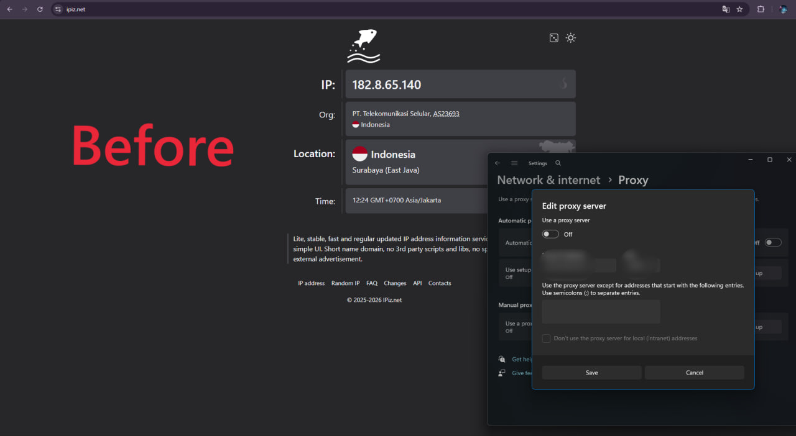

# Rotating-ip
High-performance Go rotating proxy pool for web scraping with automatic health checks, latency-based proxy selection, cooldown, and periodic proxy refresh.

# Go Rotating Proxy

High-performance rotating proxy pool written in Go, designed for web scraping and automated HTTP/HTTPS requests.

The service automatically fetches proxies from an API, performs parallel health checks, measures latency, removes unhealthy proxies from active use, and rotates to the fastest available proxy.

## Features

* Fast concurrent proxy health checking
* Automatic proxy pool refresh
* Latency-based proxy selection
* Automatic cooldown for failed proxies
* HTTP proxy support
* HTTPS `CONNECT` support
* Proxy authentication support
* Automatic saving of healthy proxies to `rotating.txt`
* Lightweight Go binary
* Management API for monitoring the proxy pool
* Suitable for web scraping workflows

---

## Architecture

```text
                    Proxy API
                       │
                       ▼
                ┌───────────────┐
                │ Proxy Manager │
                └───────┬───────┘
                        │
                 Parallel health check
                        │
          ┌─────────────┼─────────────┐
          ▼             ▼             ▼
       Proxy A       Proxy B       Proxy C
        120ms          80ms          95ms
          │             │             │
          └─────────────┼─────────────┘
                        ▼
                  Fastest Proxy
                        │
                        ▼
                  Scraper / Client
                        │
                        ▼
                  Target Website
```

The proxy manager continuously evaluates the available proxies and prefers healthy low-latency proxies.

---

# Requirements

Recommended environment:

* Ubuntu 22.04 or newer
* Go 1.22+
* Internet connection
* Proxy API endpoint

Check Go:

```bash
go version
```

---

# Installation

## 1. Clone repository

```bash
git clone [https://github.com/TaliGanda/Rotating-ip.git]
cd Rotating-ip
```

Replace `root/Rotating-ip` with your actual GitHub repository.

---

## 2. Install Go

On Ubuntu:

```bash
sudo apt update
sudo apt install -y golang
```

Verify:

```bash
go version
```

---

## 3. Initialize Go module

If the repository does not already contain `go.mod`:

```bash
go mod init rotator
```

Download dependencies:

```bash
go mod tidy
```

---

# Configuration

Create an environment file:

```bash
nano .env
```

Example:

```bash
PROXY_API_URL='https://api.example.com/scraped?token=YOUR_TOKEN&timeout=1000&excludeASN=&includeASN=&excludeCountry=&includeCountry=&type='

LISTEN_ADDR='0.0.0.0:8080'
MANAGEMENT_ADDR='127.0.0.1:8090'

REFRESH_INTERVAL='5m'
HEALTH_TIMEOUT='1000ms'
API_TIMEOUT='15s'
CHECK_WORKERS='100'

MAX_FAILURES='3'
COOLDOWN_BASE='15s'

HEALTH_URL='http://connectivitycheck.gstatic.com/generate_204'
```

## Configuration options

| Variable           |                      Default | Description                          |
| ------------------ | ---------------------------: | ------------------------------------ |
| `PROXY_API_URL`    |                     required | API used to retrieve proxy addresses |
| `LISTEN_ADDR`      |             `127.0.0.1:8080` | Proxy listener                       |
| `MANAGEMENT_ADDR`  |             `127.0.0.1:8090` | Management API                       |
| `REFRESH_INTERVAL` |                         `5m` | Proxy pool refresh interval          |
| `HEALTH_TIMEOUT`   |                     `1200ms` | Maximum health-check duration        |
| `API_TIMEOUT`      |                        `15s` | API request timeout                  |
| `CHECK_WORKERS`    |                        `100` | Concurrent health checks             |
| `MAX_FAILURES`     |                          `3` | Failures before cooldown             |
| `COOLDOWN_BASE`    |                        `15s` | Initial proxy cooldown               |
| `HEALTH_URL`       | Google connectivity endpoint | Health-check target                  |

> Never commit your API token to GitHub.

Add `.env` to `.gitignore`:

```bash
echo ".env" >> .gitignore
```

---

# Build

Build the binary:

```bash
go build -o rotator .
```

Run:

```bash
./rotator
```

Expected output:

```text
API mengembalikan 142 proxy
health-check selesai: 37/142 proxy sehat
rotating proxy listening on 0.0.0.0:8080
management API listening on 127.0.0.1:8090
```

---

# Test the Proxy Pool

Check health:

```bash
curl http://127.0.0.1:8090/health
```

Example:

```json
{
  "healthy": 37,
  "total": 142
}
```

View proxy statistics:

```bash
curl http://127.0.0.1:8090/proxies
```

Manual refresh:

```bash
curl -X POST http://127.0.0.1:8090/refresh
```

---

# Using the Rotating Proxy

The local proxy listens on:

```text
http://127.0.0.1:8080
```

Example with `curl`:

```bash
curl \
  -x http://127.0.0.1:8080 \
  https://example.com
```

For HTTPS:

```bash
curl \
  --proxy http://127.0.0.1:8080 \
  https://example.com
```

---

# Python Example

The rotating proxy can be used from Python without modifying the proxy manager.

```python
import requests

proxy = "http://127.0.0.1:8080"

proxies = {
    "http": proxy,
    "https": proxy,
}

response = requests.get(
    "https://example.com",
    proxies=proxies,
    timeout=20,
)

print(response.status_code)
print(response.text[:200])
```

The scraper talks only to the local Go proxy. The Go service decides which upstream proxy to use.

---

# Before 
<p align="center">
  
</p>

& After

## Before: Direct Connection

```text
Scraper
   │
   ▼
Internet
   │
   ▼
Website
```

Example:

```text
Request #1 → 103.59.xxx.xxx
Request #2 → 103.59.xxx.xxx
Request #3 → 103.59.xxx.xxx
```

All requests originate from the same outbound IP.

### Screenshot

`docs/before.png`

```text

```

---

## After: Rotating Proxy

```text
                 ┌─ Proxy A
                 │
Scraper → Go ────┼─ Proxy B
                 │
                 ├─ Proxy C
                 │
                 └─ Proxy D
                        │
                        ▼
                     Website
```

Example:

```text
Request #1 → Proxy A → IP A
Request #2 → Proxy B → IP B
Request #3 → Proxy C → IP C
Request #4 → Proxy A → IP A
```

### Screenshot

`docs/after.png`

```text

```

> The actual before/after screenshots in this README should show the outbound IP observed by the destination test endpoint.

---

# Recommended Screenshot Layout

For the GitHub README, place the images here:

```text
docs/
├── before.png
└── after.png
```

Then the README will display:

### Before


### After


A useful comparison is to show the IP returned by an IP-check endpoint before using the proxy and after enabling the rotating proxy.

---

# Automatic Startup With systemd

Create a service:

```bash
sudo nano /etc/systemd/system/rotator.service
```

Use:

```ini
[Unit]
Description=Go Rotating Proxy
After=network-online.target
Wants=network-online.target

[Service]
Type=simple
User=root
WorkingDirectory=/root/rotator
EnvironmentFile=/root/rotator/.env
ExecStart=/root/rotator/rotator
Restart=always
RestartSec=5

LimitNOFILE=65535

[Install]
WantedBy=multi-user.target
```

Reload systemd:

```bash
sudo systemctl daemon-reload
```

Enable startup:

```bash
sudo systemctl enable rotator
```

Start:

```bash
sudo systemctl start rotator
```

Check:

```bash
sudo systemctl status rotator
```

View logs:

```bash
sudo journalctl -u rotator -f
```

---

# Firewall

If the proxy must be accessed from another machine:

```bash
sudo ufw allow 8080/tcp
```

The management API should preferably stay local:

```bash
MANAGEMENT_ADDR='127.0.0.1:8090'
```

This prevents the management endpoints from being exposed publicly.

---

# Performance Tuning

For larger proxy pools:

```bash
CHECK_WORKERS='100'
HEALTH_TIMEOUT='1000ms'
REFRESH_INTERVAL='5m'
```

Increase `CHECK_WORKERS` carefully according to the VPS resources and the size of the proxy pool.

For example:

```bash
CHECK_WORKERS='200'
```

The application uses concurrent health checks rather than testing every proxy sequentially.

---

# Proxy Selection

The service does not blindly select a random proxy.

Healthy proxies are ranked using their observed latency and reliability.

Example:

```text
Proxy A   82ms   healthy
Proxy B   96ms   healthy
Proxy C  740ms   healthy
Proxy D timeout  unhealthy
```

The fastest healthy proxy receives priority.

Failed proxies enter a temporary cooldown:

```text
Failure 1 → 15s
Failure 2 → 30s
Failure 3 → 60s
```

This prevents repeatedly sending requests through unavailable upstream proxies.

---

# Troubleshooting

## `PROXY_API_URL belum di-set`

Check:

```bash
echo "$PROXY_API_URL"
```

When using `.env`:

```bash
set -a
source /root/rotator/.env
set +a
```

Then:

```bash
./rotator
```

If your URL contains `&`, quote the entire value:

```bash
PROXY_API_URL='https://api.example.com/scraped?token=XXX&timeout=1000&type='
```

---

## `ERR_CONNECTION_REFUSED`

Check the listening socket:

```bash
ss -lntp | grep -E ':8080|:8090'
```

For remote access, the proxy should normally listen on:

```bash
LISTEN_ADDR='0.0.0.0:8080'
```

Also check the firewall:

```bash
sudo ufw status
```

---

## No healthy proxies

Check the pool:

```bash
curl http://127.0.0.1:8090/health
```

Then manually refresh:

```bash
curl -X POST http://127.0.0.1:8090/refresh
```

Common causes:

* Upstream proxies are offline
* Health timeout is too strict
* Proxy API returned an empty list
* VPS cannot reach the upstream proxies
* The health-check endpoint is unavailable

---

## `Too many open files`

Check:

```bash
ulimit -n
```

For systemd, the service includes:

```ini
LimitNOFILE=65535
```

After modifying the service:

```bash
sudo systemctl daemon-reload
sudo systemctl restart rotator
```

---

# Security

Do not publish secrets:

```text
❌ API token
❌ proxy credentials
❌ private configuration
```

Use:

```text
.env
```

and add it to:

```text
.gitignore
```

Example:

```gitignore
.env
rotating.txt
rotator
*.log
```

---

# Project Structure

Recommended repository structure:

```text
rotating-proxy/
├── main.go
├── go.mod
├── go.sum
├── README.md
├── .gitignore
└── docs/
    ├── before.png
    └── after.png
```

---

# License

Choose a license appropriate for your project.

For example:

```text
MIT License
```

See `LICENSE` for the full license text.
